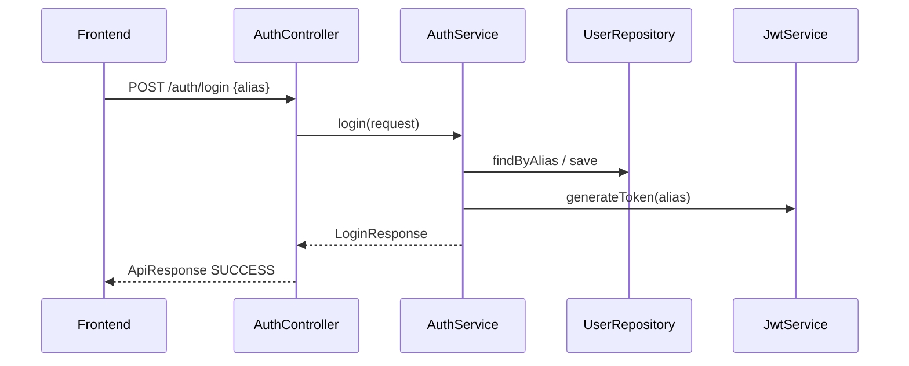
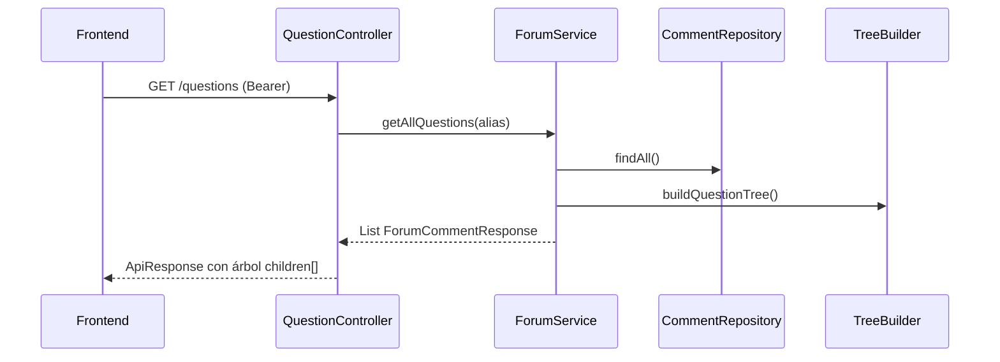
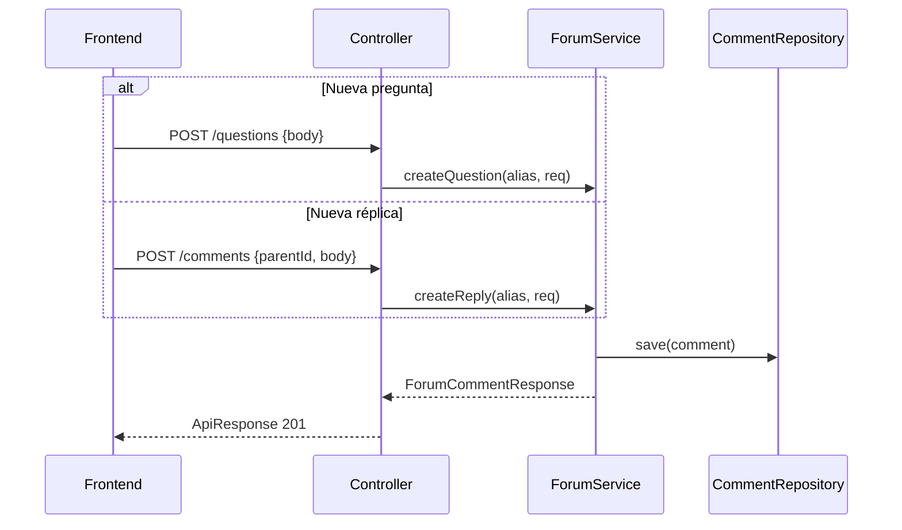
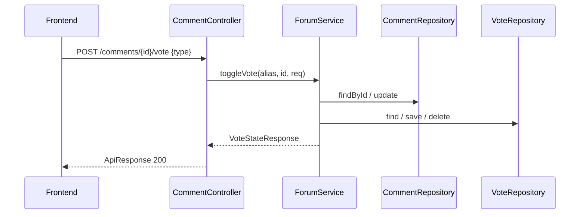

# Implementación Backend ForumHub

**Commit base:** `c022329`  
**Fecha:** 2026-09-13  
**QA:** ✅ 22/22 tests PASS — ver `documentation/qa-test-results.md`

---

## Resumen

Backend REST Spring Boot 4.1.1 con persistencia JSON local, JWT stateless y contrato `ApiResponse<T>` compatible con el frontend ForumHub Angular.

---

## Endpoints implementados

| Método | Ruta | Auth | Descripción |
|--------|------|------|-------------|
| `POST` | `/auth/login` | No | Login Get or Create por alias |
| `POST` | `/auth/logout` | Sí | Cierre de sesión stateless |
| `GET` | `/questions` | Sí | Árbol de preguntas con réplicas |
| `POST` | `/questions` | Sí | Nueva pregunta raíz |
| `POST` | `/comments` | Sí | Nueva réplica |
| `POST` | `/comments/{id}/vote` | Sí | Toggle like/dislike |

---

## Diagrama — Login



---

## Diagrama — Carga del foro



---

## Diagrama — Publicar pregunta/réplica



---

## Diagrama — Votos



---

## Estructura del proyecto

```
src/main/java/com/example/foro_backend/
├── config/         AppProperties, CORS, JWT interceptor, DataInitializer
├── controller/     AuthController, QuestionController, CommentController
├── dto/            ApiResponse, auth/*, forum/*
├── exception/      GlobalExceptionHandler, excepciones custom
├── mapper/         CommentMapper, TreeBuilder
├── model/          UserModel, CommentModel, VoteModel
├── repository/     Interfaces + impl/Json*
├── security/       AuthenticatedUserContext
├── service/        AuthService, ForumService, JwtService
└── util/           UserPresentationHelper, DateLabelHelper
```

---

## Ejemplos cURL

```bash
# Login
curl -X POST http://localhost:8080/auth/login \
  -H "Content-Type: application/json" \
  -d '{"alias":"moises_dev"}'

# Logout
curl -X POST http://localhost:8080/auth/logout \
  -H "Authorization: Bearer <token>"

# Listar foro
curl http://localhost:8080/questions \
  -H "Authorization: Bearer <token>"

# Nueva pregunta
curl -X POST http://localhost:8080/questions \
  -H "Authorization: Bearer <token>" \
  -H "Content-Type: application/json" \
  -d '{"body":"¿Cómo estructurar el árbol?"}'

# Réplica
curl -X POST http://localhost:8080/comments \
  -H "Authorization: Bearer <token>" \
  -H "Content-Type: application/json" \
  -d '{"parentId":"q1","body":"De acuerdo."}'

# Voto
curl -X POST http://localhost:8080/comments/q1/vote \
  -H "Authorization: Bearer <token>" \
  -H "Content-Type: application/json" \
  -d '{"type":"like"}'
```

---

## Referencias

- `documentation/api-backend-implementacion.md` — Mapping detallado
- `documentation/decisiones-arquitectura.md` — Decisiones de diseño
- `documentation/qa-test-results.md` — Resultados QA
