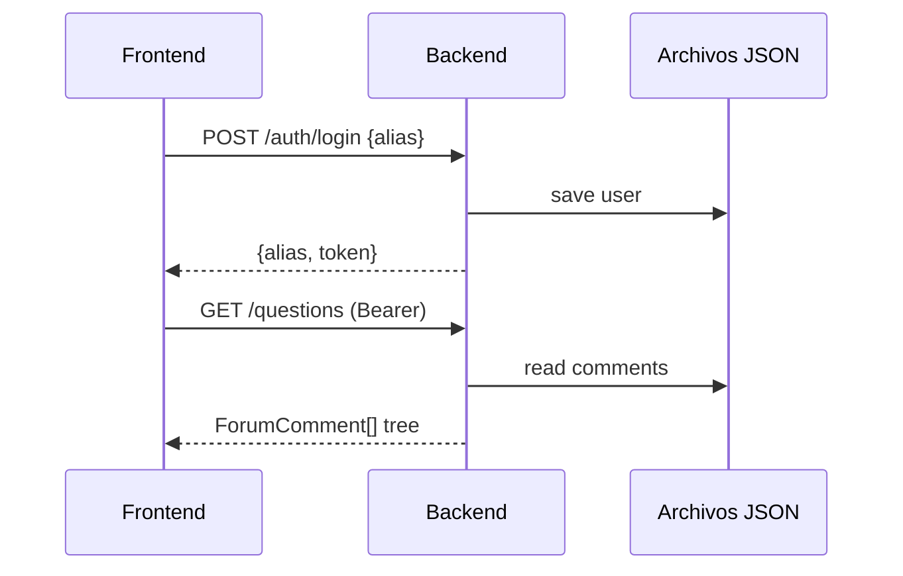

# Tarea 17 — Documentación

**Dificultad:** ⭐⭐ (media-baja)  
**Dependencias:** 16 (QA exitoso)  
**Estimación:** 1 h  
**Estado:** ✅ Completada

---

## Objetivo

Documentar la implementación final una vez que las pruebas QA pasen al 100%.

---

## Entregables

### 1. Documento por commit

Ruta: `documentation/{idCommit}_{fecha}.md`

Contenido:
- Resumen de endpoints implementados
- Diagramas de flujo (mermaid): login, carga foro, crear pregunta/réplica, votos
- Decisiones tomadas (contrato ApiResponse vs DTO directo, estrategia JWT, seed)
- Estructura de archivos JSON
- Ejemplos cURL por endpoint

### 2. Actualizar referencia cruzada

- Enlazar desde `documentation/api-requests-flujo.md` (sección backend) o crear `documentation/api-backend-implementacion.md` con mapping endpoint → controller → service

---

## Diagramas sugeridos

---

## Criterios de aceptación

- [x] Documentación creada tras QA 100% exitoso
- [x] Diagramas incluidos
- [x] Ejemplos cURL verificados
- [x] Decisiones de diseño documentadas

---

## Referencias

- `.cursor/for_backend.mdc` — Reglas de documentación
