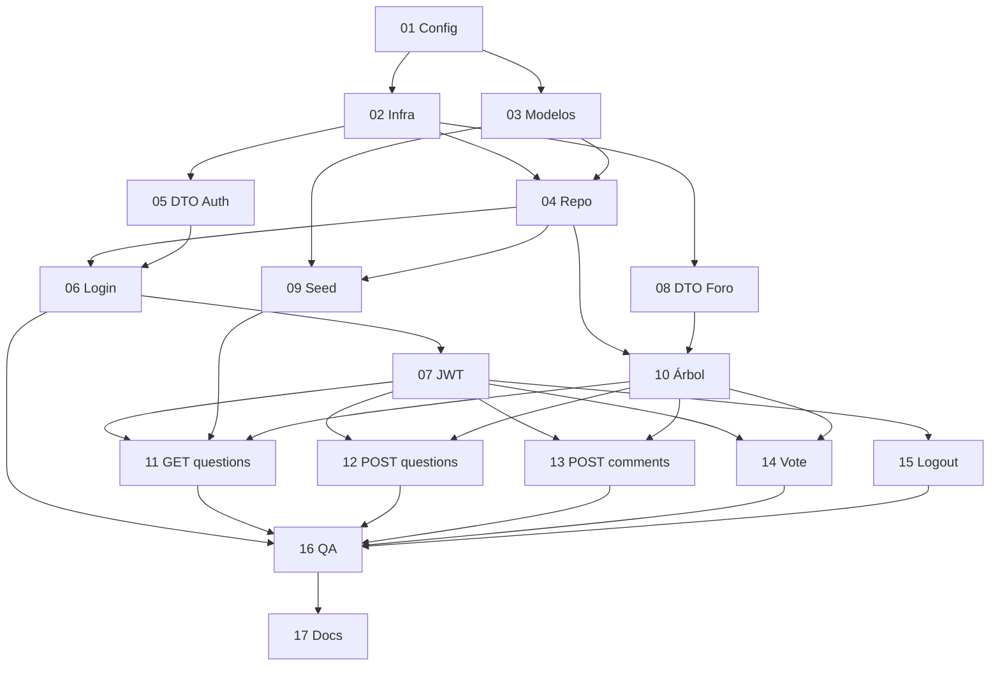

# Tareas — Backend ForumHub

Plan de implementación de los endpoints que espera el frontend (`documentation/api-requests-flujo.md`).

**Estado del proyecto:** Spring Boot 4.1.1 recién inicializado, sin capas de dominio ni controladores.

**Referencia de arquitectura:** `.cursor/for_backend.mdc`

---

## Orden de ejecución (menor → mayor dificultad)

| # | Tarea | Dificultad | Depende de |
|---|-------|------------|------------|
| 00 | [Decisiones de arquitectura](./00-decisiones-arquitectura.md) | ⭐ | — |
| 01 | [Configuración del proyecto](./01-configuracion-proyecto.md) | ⭐ | 00 |
| 02 | [Infraestructura base](./02-infraestructura-base.md) | ⭐ | 01 |
| 03 | [Modelos de dominio JSON](./03-modelos-dominio-json.md) | ⭐⭐ | 01 |
| 04 | [Repositorio JSON](./04-repositorio-json.md) | ⭐⭐ | 02, 03 |
| 05 | [DTOs de autenticación](./05-dtos-autenticacion.md) | ⭐⭐ | 02 |
| 06 | [Endpoint POST /auth/login](./06-endpoint-auth-login.md) | ⭐⭐ | 04, 05 |
| 07 | [JWT y filtro de seguridad](./07-jwt-y-seguridad.md) | ⭐⭐⭐ | 06 |
| 08 | [DTOs del foro](./08-dtos-foro.md) | ⭐⭐ | 02 |
| 09 | [Seed data inicial](./09-seed-data-inicial.md) | ⭐⭐ | 03, 04 |
| 10 | [Servicio árbol de comentarios](./10-servicio-arbol-comentarios.md) | ⭐⭐⭐ | 04, 08 |
| 11 | [Endpoint GET /questions](./11-endpoint-get-questions.md) | ⭐⭐⭐ | 07, 09, 10 |
| 12 | [Endpoint POST /questions](./12-endpoint-post-questions.md) | ⭐⭐⭐ | 07, 10 |
| 13 | [Endpoint POST /comments](./13-endpoint-post-comments.md) | ⭐⭐⭐ | 07, 10 |
| 14 | [Endpoint POST /comments/:id/vote](./14-endpoint-post-vote.md) | ⭐⭐⭐⭐ | 07, 04, 10 |
| 15 | [Endpoint POST /auth/logout](./15-endpoint-auth-logout.md) | ⭐⭐ | 07 |
| 16 | [Pruebas QA](./16-pruebas-qa.md) | ⭐⭐⭐⭐ | 06–15 |
| 17 | [Documentación](./17-documentacion.md) | ⭐⭐ | 16 |

---

## Endpoints objetivo

| Método | Ruta | Auth | Tarea |
|--------|------|------|-------|
| `POST` | `/auth/login` | No | 06 |
| `POST` | `/auth/logout` | Sí | 15 |
| `GET` | `/questions` | Sí | 11 |
| `POST` | `/questions` | Sí | 12 |
| `POST` | `/comments` | Sí | 13 |
| `POST` | `/comments/:id/vote` | Sí | 14 |

---

## Decisiones de arquitectura (cerradas)

| Tema | Decisión |
|------|----------|
| Contrato API | **`ApiResponse<T>`** — frontend lee `response.data` |
| Login | **Get or Create** — sin 409 por alias duplicado |
| Logout | **Stateless simple** — token eliminado en cliente |

Ver: `documentation/decisiones-arquitectura.md` y `task/00-decisiones-arquitectura.md`

---

## Diagrama de dependencias

